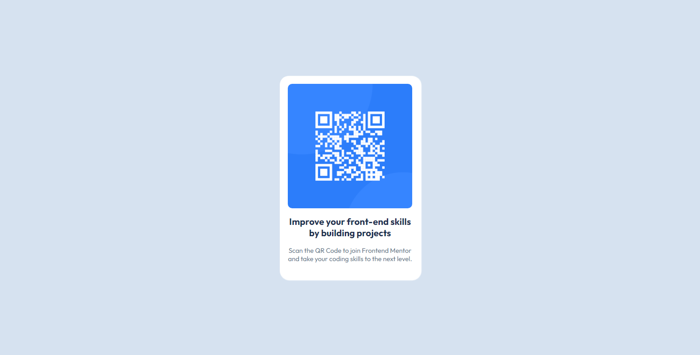

# Frontend Mentor - QR Code Component Solution

This is my solution to the [QR Code Component Challenge on Frontend Mentor](https://www.frontendmentor.io/challenges/qr-code-component-iux_sIO_H). This challenge helped me improve my frontend development skills by working on a simple yet effective project.

## Table of Contents

- [Overview](#overview)
  - [Screenshot](#screenshot)
  - [Links](#links)
- [My Process](#my-process)
  - [Built With](#built-with)
  - [What I Learned](#what-i-learned)
  - [Future Improvements](#future-improvements)
  - [Useful Resources](#useful-resources)
- [Author](#author)

## Overview

### Screenshot



_Add a screenshot of your project by replacing the placeholder above._

### Links

- **Solution URL:** [View on Frontend Mentor](https://your-solution-url.com)
- **Live Site URL:** [View Live Project](https://your-live-site-url.com)

## My Process

### Built With

- Semantic HTML5
- CSS custom properties
- Flexbox
- Mobile-first workflow

### What I Learned

This project reinforced my understanding of **CSS layout techniques** and the importance of a **mobile-first approach**. Below is an example of a CSS snippet that helped me style the QR code component:

```css
.container{
    max-width: 320px;
    padding-inline: 1.1rem;
    padding-block: 1.1rem;
    background: hsl(0, 0%, 100%);
    box-shadow: 0.1rem 0.1rem 0.1rem 0.1rem #fff;
    border-radius: 20px;
}
```

### Future Improvements

- Improve accessibility by adding **ARIA labels**.
- Experiment with **CSS animations** for a more dynamic UI.
- Explore adding **dark mode** support.

## Author

- **Frontend Mentor:** [@Oumarou Sanda Souley](https://www.frontendmentor.io/profile/OumarouSandaSouley)
- **GitHub:** [@yourgithub](https://github.com/OumarouSandaSouley)
**Twitter**: [@OumarouSandaSouley](https://github.com/OumarouSandaSouley)
Feel free to check out my other projects!

